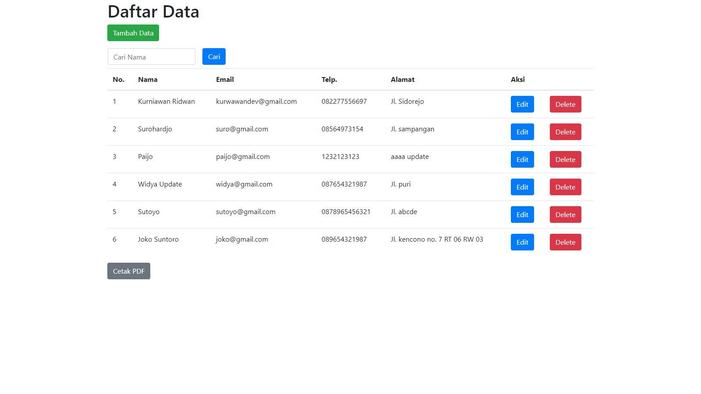
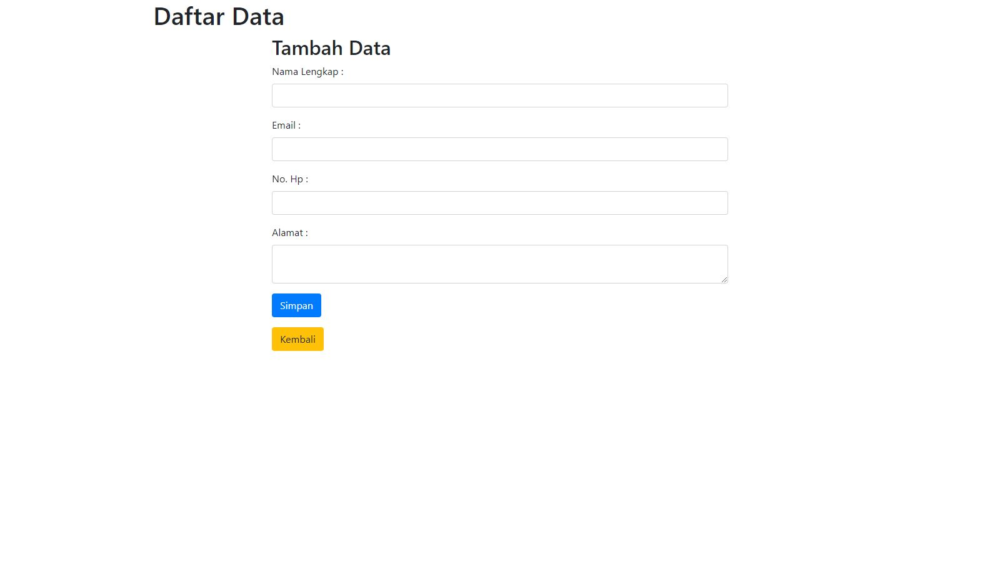
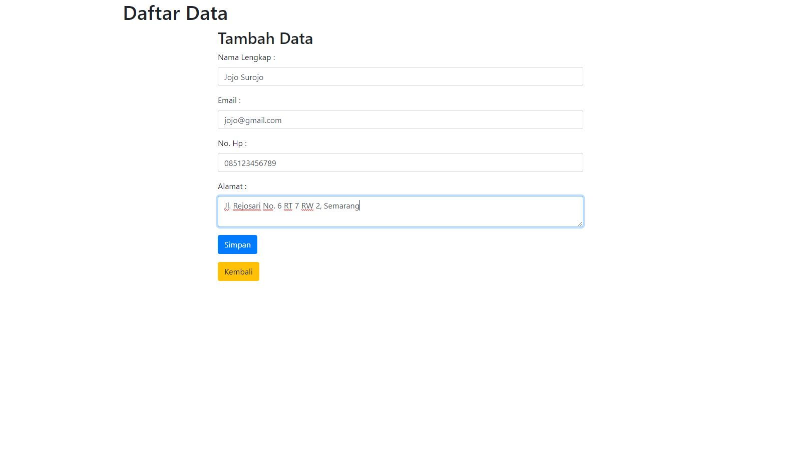
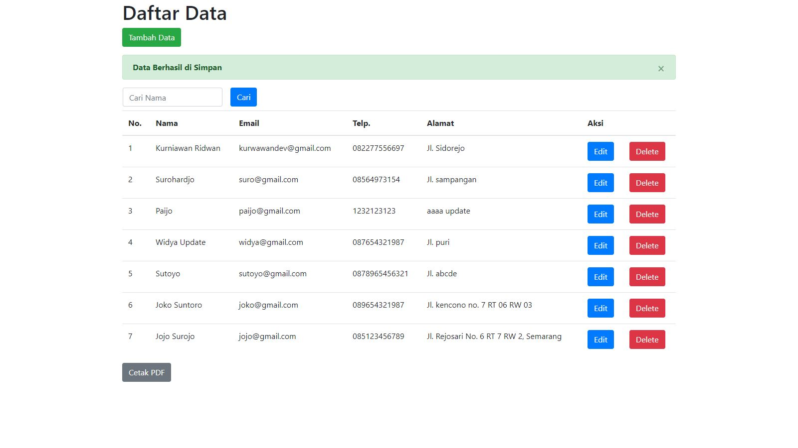
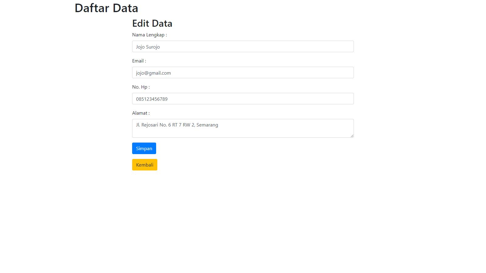
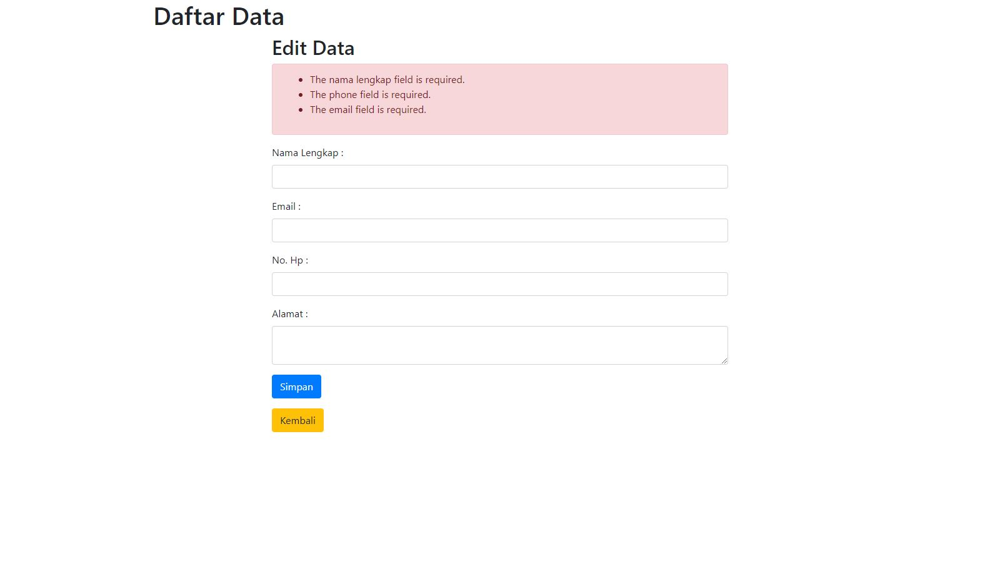
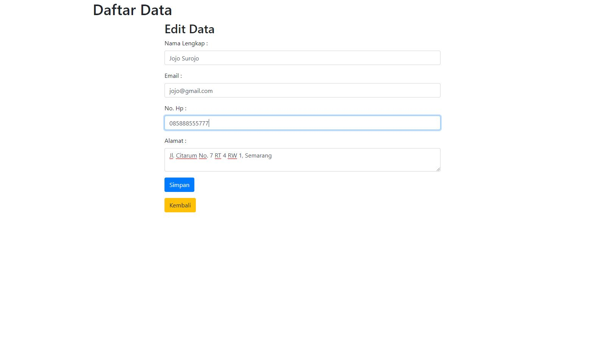
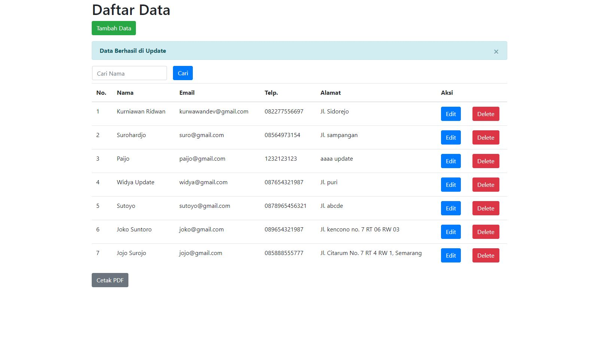
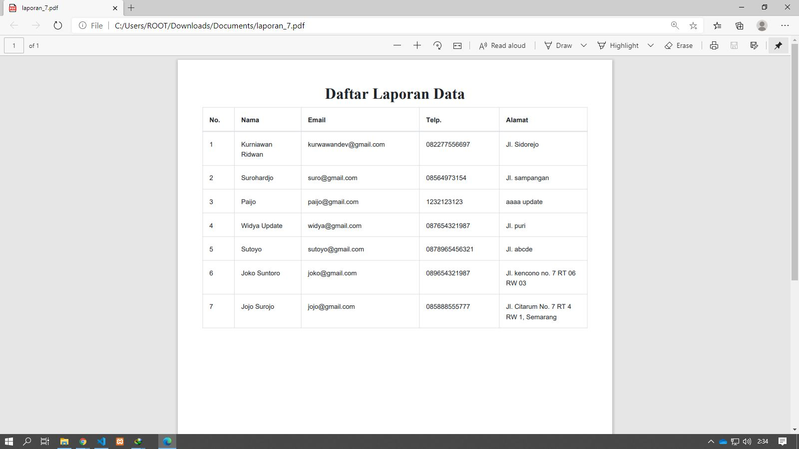
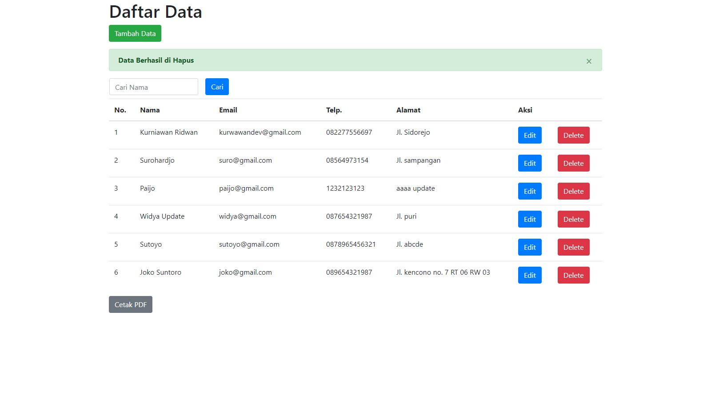

    <h2>Dokumentasi</h2>

<b>1.) Home Page</b>

Halaman awal menamppilkan keseluruhan data.

<b>2.) Halaman Tambah Data</b>

Melakukan input data terdiri dari Nama Lengkap, Email, No. Hp dan Alamat. Button Simpan untuk menyimpang data sedangkan button Kembali untuk kembali ke halaman home.

Muncul alert yang berarti field Nama Lengkap, Email dan No. Hp wajib di isi.

Field saat terisi inputan kemudian klik button Simpan.

Secara bersamaan muncul alert untuk menandakan bahwa data berhasil disimpan.

<b>3.) Halaman Edit Data</b>

Tampilan halaman ketika setelah melakukan klik pada button Edit.

Muncul alert yang berarti field Nama Lengkap, Email dan No. Hp wajib di edit / tidak boleh kosong.

Field saat terisi inputan/sudah di edit kemudian klik button Simpan.

Muncul alert untuk menandakan bahwa data berhasil di edit.

<b>4.) Export PDF</b>

Klik button Cetak PDF kemudian akan men-download file laporan dalam bentuk pdf.

<b>5.) Halaman Delete Data</b>

Ketika melakukan klik button Delete data akan terhapus dan secara muncul alert untuk menandakan data berhasil dihapus.

<b>Build by framework :</b>

